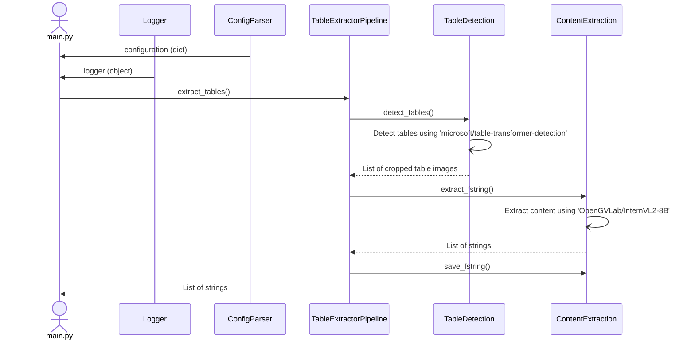

# Pipeline 4

## Table of Contents
1. [Introduction](#introduction)
2. [Architecture](#architecture)
3. [Sequence Diagram](#sequence-diagram)
4. [Configuration Parameters](#configuration-parameters)
5. [Execution](#execution)
6. [Results](#results)
7. [Observations](#observations)
8. [Conclusions](#conclusions)
9. [References](#references)
10. [Future Scope](#future-scope)

---

## Introduction

This pipeline is designed to extract textual data from tables in various documents while preserving the relationships between the table's cells, ultimately generating a formatted string as per the requirements.

The pipeline assumes the documents have been converted to images. 

- **Input:** Image
- **Output:** List of fstrings for every table in the image

The following models are used:
1. Table Detection: [**microsoft/table-transformer-detection**](https://huggingface.co/microsoft/table-transformer-detection)
2. Content Extraction: [**OpenGVLab/InternVL2-8B**](https://huggingface.co/OpenGVLab/InternVL2-8B)

---

## Architecture


Pipeline A:
- *Question A1:* 

    "\<image\>\n Structure the text into a table as shown in the image. Don't include a preamble."

The LLM is called only once. It returns the markdown table.

Pipeline B:
- *Question B1:* 

    "\<image\>\n Structure the text into a table as shown in the image. Return a json. Return multiple json if there are multiple tables. Don't include a preamble."
- *Question B2:* 

    f"\<json\>{json_response}\</json\>\n Convert json to table."

The LLM is called twice. First time it structures the text in the table into a json. Second time, it converts the json into a markdown table.

---

## Sequence Diagram



---

## Configuration Parameters

The configuration file is found at `./code/pipeline4/config.json`

| Parameter | Description | Type | Default | Required |
| --------- | ----------- | ---- | ------- | -------- |
| input_path | Input folder path for images | string | - | &#x2713; |
| output_path | Folder path to store output files | string | ./outputs/pipeline4/ | &#x2718; |
| table_detection_threshold | Threshold for table detection | float | 0.9 | &#x2718; |
| padding | Padding to crop detected tables | int | 10 | &#x2718; |
| max_new_tokens | Max new tokens generated by the llm | int | 1024 | &#x2718; |
| load_in_8bit | 8-bit quantization with bitsandbytes. If false, 4-bit quantization will be used | boolean | False | &#x2718; |
| use_pipeline_a | If true- use pipeline A, else use pipeline B.  | boolean | True | &#x2718; |
| log_file_path | If log_file_path is not given, log file is not created and the logs are only printed on the command line. | string | None | &#x2718; |
| save_temp_files | If true- save cropped table image, and box cordinates | boolean | True | &#x2718; |
| cache | Folder path to store model cache files | string | ./cache/ | &#x2718; |

---

## Execution

1. Install the required libraries
```
pip install -r ./code/pipeline4/requirements.txt
```
> **Note**: The execution of the large language model requires a GPU with CUDA installed. The version of pytorch, CUDA and related libraries depends on the hardware. The requirements file provided installs - torch==2.4.0+cu121, and torchvision==0.19.0+cu121. Please install the appropriate libraries from [Pytorch Get Started](https://pytorch.org/get-started/locally/).
2. Install flash-attention
```
pip install flash_attn==2.6.3
```
> **Note**: The OpenGVLab/InternVL2-8B model requires [flash-attention](https://github.com/Dao-AILab/flash-attention) which can take a long time to install.
3. Update the config file with desired parameters.
4. Run the main file
```
python ./code/pipeline4/main.py
```

---

## Results

### **Archetype 1**: The simple table without row names
| Image                                                               |   Pipeline A Cosine Similarity |   Pipeline B Cosine Similarity |
|:--------------------------------------------------------------------|-------------------------------:|-------------------------------:|
| 654e5f813f576c5cd372f6d3_HTML Table Generator _ HTML Tables (4)     |                       **1**        |                       1        |
| Table-5                                                             |                      **0.999605** |                        0.989585 |
| 3.png                                                               |                       **0.951028** |                       0.951028 |
| hondaactivaconsumerbehaviour-200612061532-32                        |                       **0.931327** |                       0.883528 |
| Kontaminanten in Lebensmitteln_DE-images-15                         |                       **0.680643** |                       0.645213 |
| Ledger with opening balance and multiple bill wise details-images-3 |                       0.811818 |                       **0.830039** |
| OIP (2)                                                             |                       **0.959366** |                       0.942075 |
| Technical manual_PAVEMENT MAINTENANCE MANAGEMENT-images-57          |                       0.892348 |                       **0.893599** |

>Archetype 2 is not being detected correctly. It is represented as Archetype 1.

### **Archetype 3**: The compound-headlines
| Image                                                               |   Pipeline A Cosine Similarity |   Pipeline B Cosine Similarity |
|:--------------------------------------------------------------------|-------------------------------:|-------------------------------:|
| hondaactivaconsumerbehaviour-200612061532-images-7                  |                       0.778396 |                       **0.867042** |
| Kontaminanten in Lebensmitteln_DE-images-9                          |                       0.687661 |                       **0.734957** |
| technical-manual-20th-edition-methods-and-appendices-images-32      |                       0.898757 |                       **0.926467** |

>Pipeline B is generating a table with combined headings.

### **Archetype 4**: No headlines
| Image                                                               |   Pipeline A Cosine Similarity |   Pipeline B Cosine Similarity |
|:--------------------------------------------------------------------|-------------------------------:|-------------------------------:|
| Kontaminanten in Lebensmitteln_DE-images-11                         |                       **0.91735**  |                       0.82526  |
| Kontaminanten in Lebensmitteln_DE-images-10                         |                       **0.860905** |                       0.79676  |
| Kontaminanten in Lebensmitteln_DE-images-12                         |                       0.508704 |                       **0.523786** |
| Kontaminanten in Lebensmitteln_DE-images-13                         |                       **0.651695** |                       0.624464 |
| Kontaminanten in Lebensmitteln_DE-images-14                         |                       **0.461317** |                       0.461317 |


- Average time taken Pipeline A - 76.75 s
- Average time taken Pipeline B - 154.25 s

---

## Observations

- The [**OpenGVLab/InternVL2-8B**](https://huggingface.co/OpenGVLab/InternVL2-8B) is able to efficiently extract textual data from tables while preserving the relationships between the table's cells.
- It can extract different languages without user input.
- Pipeline A works well in most simple cases.
- Pipeline A is faster.
- Pipeline B does a good job for *Archetype 3: The compound-headlines*.
- Pipeline B takes more time as the LLM is called twice.

---

## Conclusions

| Archetype | Pipeline |
|---|---|
| 1 | A |
| 2 | A |
| 3 | B |
| 4 | A |

- **Edge Case 1**: Tables that have no borders

    The table transformer detection model is able to detect tables without borders as well.

- **Edge Case 2**: Tables that start on one page and proceed on other pages without repeating the headlines

    Not covered.

---

## References

1. [microsoft/table-transformer-detection](https://huggingface.co/microsoft/table-transformer-detection)
2. [OpenGVLab/InternVL2-8B](https://huggingface.co/OpenGVLab/InternVL2-8B)
3. [OpenGVLab/InternVL Spaces](https://huggingface.co/spaces/OpenGVLab/InternVL)
4. [Table Transformer](https://huggingface.co/docs/transformers/en/model_doc/table-transformer)
4. [Multi-Modal on PDF’s with tables](https://docs.llamaindex.ai/en/v0.9.48/examples/multi_modal/multi_modal_pdf_tables.html)
5. [TC-OCR: TableCraft OCR for Efficient Detection & Recognition of Table Structure & Content](https://arxiv.org/html/2404.10305v1)
6. [Inference with table transformer](https://github.com/microsoft/table-transformer/blob/main/docs/INFERENCE.md)
7. [Table transformers tutorials](https://github.com/NielsRogge/Transformers-Tutorials/tree/master/Table%20Transformer)
8. [Table Bank](https://github.com/doc-analysis/TableBank/tree/master)
9. [Table Bank dataset](https://paperswithcode.com/dataset/tablebank)

---

## Future Scope

- Introduce more variety in the test data - different archetypes, edge cases, different languages, hand written, etc.
- Work on *Edge Case: Tables that start on one page and proceed on other pages without repeating the headlines* and *Archetype 2: The simple table with row names*.
- Unit testing the code.
- Include validations for the inputs.

---